# Biofly_Advanced

---

## Présentation

Ce projet est une extension du projet [Biofly](https://github.com/Juldetoff/PIDR_Demo_Biofly/tree/main) fait lors d'un projet d'initiation à la recherche. Cette extension rajoute diverses fonctionnalités telles que des scènes de guidage manuelles, davantages de configurations possibles, la détection de la position des utilisateurs sur les vidéos, etc.

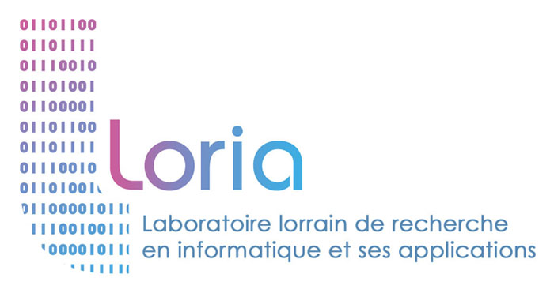

Ce travail a été fait lors de mon stage d'assistant ingénieur de 2e année à TELECOM Nancy au LORIA (Laboratoire Lorrain de Recherche en Informatique et ses Applications) sous la direction de M. Laurent Ciarletta dans l'équipe SIMBIOT.

---

## Sommaire

- [Biofly\_Advanced](#biofly_advanced)
  - [Présentation](#présentation)
  - [Sommaire](#sommaire)
  - [Installation](#installation)
  - [Utilisation](#utilisation)
    - [Utilisation de l'application](#utilisation-de-lapplication)
    - [Extension de l'application](#extension-de-lapplication)
      - [- Ajout de scènes](#--ajout-de-scènes)
      - [- Ajout d'assets](#--ajout-dassets)
    - [Utilisation des autres scripts](#utilisation-des-autres-scripts)

## Installation

Pour installer le projet, il suffit de cloner le dépôt avec la commande suivante:
  
```bash
git clone https://github.com/Juldetoff/Biofly_Advanced.git
```

Ensuite, il faut avoir au prélable installé [Unity](https://unity.com/fr) (et facultativement [Python](https://www.python.org/downloads/) pour les scripts du dossier "Autres").

Une fois l'Unity Hub lancé, il suffit d'ouvrir le projet avec le bouton "Open" et de sélectionner le dossier "Biofly_Advanced" précédemment cloné. Le hub proposera alors de télécharger les modules nécessaires au projet.

//vérif si y'a des install en plus sur un pc du techlab

## Utilisation

### Utilisation de l'application

Une fois Unity lancé avec le projet, il suffit d'aller dans le dossier "Assets/ScenesEtc/Scenes" et d'ouvrir la scène "ConfigScene" (double clic dessus). Ensuite, il est possible de lancer la scène avec le bouton "Play" en haut au milieu de l'interface de l'éditeur Unity.

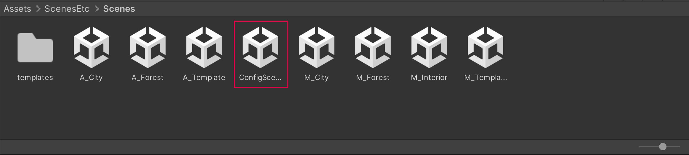

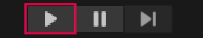

Cette scène permet de pouvoir tester les configurations possibles, en choisissant la scène, le nombre de caméras, le format et la qualité vidéo, le bruit... Il est aussi possible lors du choix de scène de choisir une scène en manuel afin de pouvoir guide manuellement la caméra et décider des angles de vue.

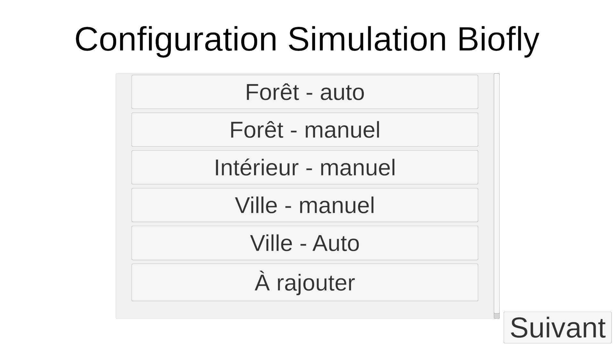
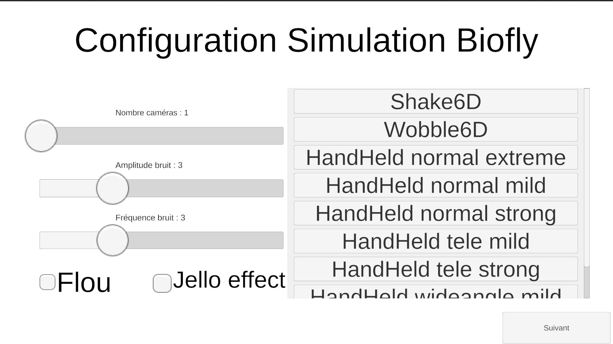
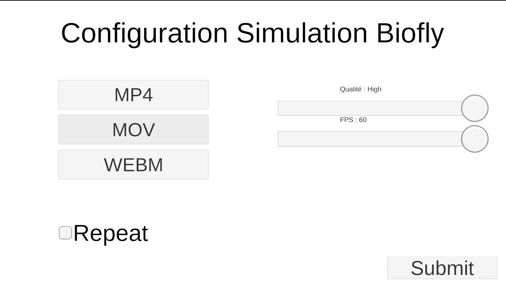

Une fois la scène terminée ou que l'on souhaite arrêter l'enregistrement, il suffit de rappuyer sur le bouton "Play" en haut au milieu de l'interface de l'éditeur Unity. Il est également possible d'appuyer sur le bouton pause afin de mettre en pause l'enregistrement et regarder la scène en détail.

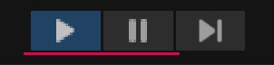

Les vidéos enregistrées se trouveront dans le dossier "Biofly_Advanced/SampleRecordings" tandis que les fichiers txt contenant les détections et positions d'objets se trouveront dans le dossier "Biofly_Advanced/Positions".

! attention ! Si les vidéos sont corrompues par une erreur de lecture, il suffit de les supprimer avant de pouvoir relancer la scène.

### Extension de l'application

Il est possible d'ajouter des scènes ou des assets au projet.

#### - Ajout de scènes

Pour ajouter une scène, il suffit de la créer à partir d'Unity :

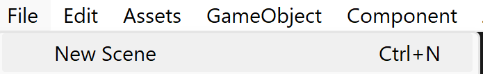
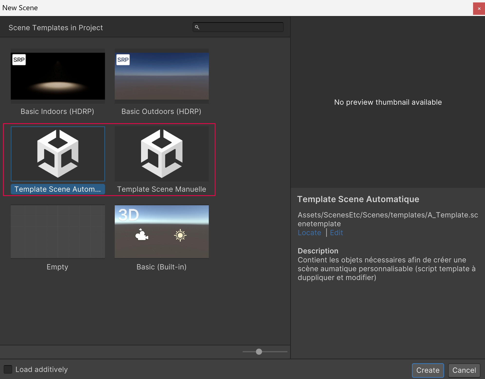

Une fois la nouvelle scène générée, il suffit de copier le script "TemplateManual" ou "TemplateAuto" selon la scène choisie, et de modifier le script duppliqué.
Une fois les modifications faites, il suffit de l'ajouter dans la scène à l'objet "DroneManager" et de copier les données du script template déjà présent sur l'objet afin d'être sûr de récupérer toute les données nécessaires.
Ensuite pour une copie du Template Manuel, il faut aller sur les deux objets "SYSCAM1" dans leur objet "CamPhysique", et dans le composant MovieRecordManual ou MovieRecordAuto, il faut lier le nouveau script créé du DroneManager. Ceci n'est pas nécessaire en Auto, mais il faut quand même recopier tout les paramètres du script template dans le nouveau script.

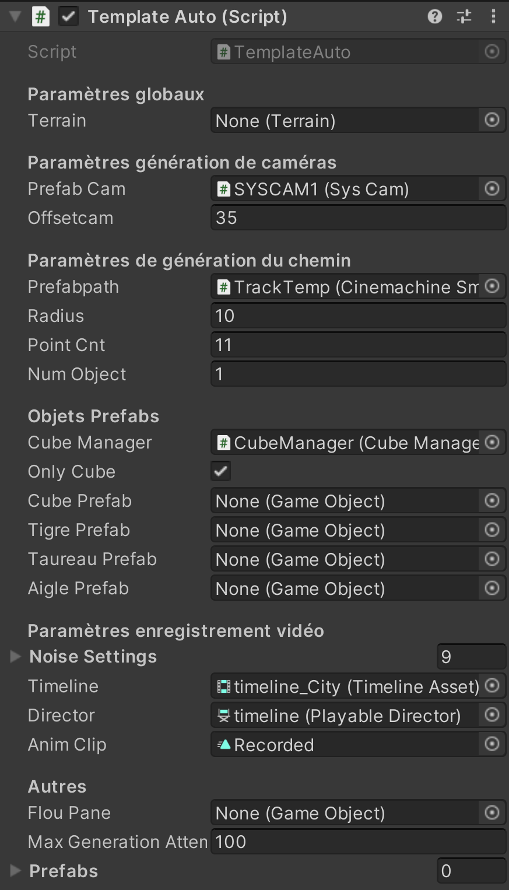
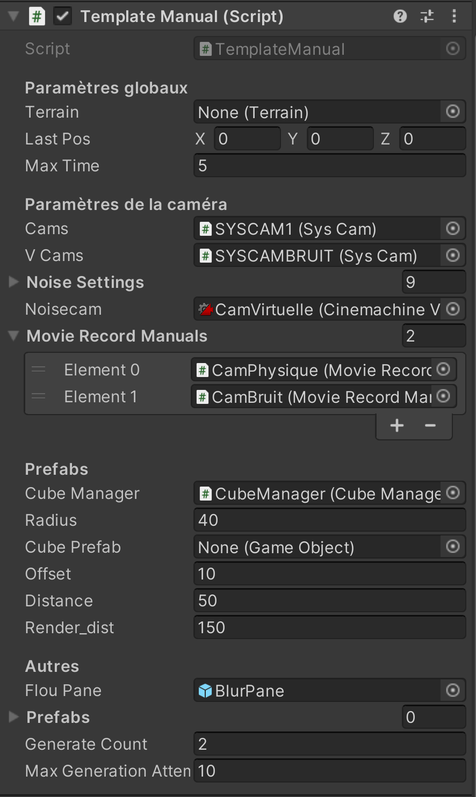

N'hésitez pas à garder la souris sur certains paramètres dans l'éditeur afin d'avoir plus d'informations sur ceux-ci.

#### - Ajout d'assets

Pour les objets, il suffit de les ajouter dans les assets, et de les modifier en leur ajoutant les scripts nécessaire :

- Pour un objet manuel, il faut ajouter les scripts Render_dist et SoloDetectableScript. Le premier permet de gérer le nombre d'objet en les faisant disparaître à partir d'une certaine distance de la caméra, le second permet de gérer les detections par l'unique caméra manuelle de la scène. Il faut associer à ces deux scripts la caméra contenant le composant "Camera" qui sera utilisée pour la détection. De plus, il faut également ajouter à l'objet des objets vides qui lui serviront de "coins" pour la détection dans la variable SmallMesh (un exemple peut être visible sur les cubes rouges).
- Pour un objet de scène auto, il suffit d'ajouter le script "DetectableScript" et de comme pour le manuel, ajouter dans SmallMesh les objets vides qui serviront de "coins" pour la détection.

### Utilisation des autres scripts

Dans le dossier "Autres" sont rangés les scripts Python qui ont diverses utilités :

- "squaredraw.py" : permet en ayant dans le même dossier un fichier vidéo nommé "camreal.mp4" et un fichier nommé "positions.txt" de dessiner les carrés de détection sur la vidéo à des fins de tests. Il suffit de lancer le script et de suivre les instructions.  
Pour lancer le script, il faut avoir installé Python et lancer la commande suivante dans le dossier "Autres" :

```bash
python3 squaredraw.py
```
